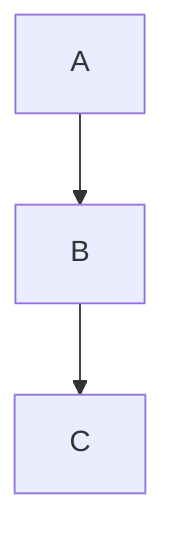

# Markdown document guide

How to prepare a markdown file that renders cleanly to PDF (via [`pdfmarq`](https://github.com/Xaeian/PDFMarQ)) and DOCX (via [`docmarq`](https://github.com/Xaeian/DocMarQ)). Both libraries share the same metadata layout, so the same source file works for both targets.

The document has three layers of metadata, all optional:

- **Frontmatter**: identifying fields (title, author, status, dates). Renders as a banner on page 1.
- **`render:` sub-block**: page geometry, fonts, chrome. Use only when you want to deviate from defaults.
- **Inline DSL**: per-block hints on images, mermaid diagrams, and layout directives in the body.

## Quick start

A minimal document needs only a title and an author:

```md
---
title: Quarterly report
author: Emilian Świtalski
---

# Summary

Revenue is up 23% year-over-year. Details in the sections below.
```

That's it. Everything else has sensible defaults.

## Frontmatter

YAML block between `---` markers at the top of the file. Controls the banner on page 1 and the mini-banner on continuation pages.

```yaml
---
id: RM-001             # document code (unique)
title: Markdown document guide
version: 2.1.3
author: Emilian Świtalski
status: approved       # draft/review/approved/deprecated/archived
entity: Gdynia Maritime University
address: Morska 81/87, 81-225 Gdynia
created: 2024-09-15    # first written, set once (YYYY-MM-DD)
updated: 2026-03-22    # last content change (YYYY-MM-DD)
sign: true             # add signature field at document end
logo: umg.svg          # .svg/.png/.jpg
subject: Short description for PDF /Subject metadata
keywords: policy, workflow, reference
---
```

`subject` and `keywords` are not rendered in the banner. They populate the document's `/Subject` and `/Keywords` metadata, visible in any PDF reader's document properties and searchable by DMS systems.

### Statuses

| Status       | Colour    | Meaning                                                       |
| ------------ | --------- | ------------------------------------------------------------- |
| `draft`      | blue-grey | Work in progress. Content is incomplete or unreviewed.        |
| `review`     | amber     | Content is complete and waiting for approval.                 |
| `approved`   | green     | Officially accepted. This is the current, binding version.    |
| `deprecated` | red       | Still accessible but no longer recommended. Being phased out. |
| `archived`   | violet    | Historical record only. Not valid for current use.            |

Typical flow is `draft` → `review` → `approved` → `deprecated` → `archived`, though not every document goes through all stages. Only one version of a document should be `approved` at a time. When approving a new version, the previous one moves to `deprecated` or `archived`.

Changing the status does not require updating `version` or `updated`. Status reflects an administrative decision, not a change to content.

### Dates

The `updated` date changes when content changes: rewritten text, fixed factual errors, added or removed sections. It does not change for status transitions, cosmetic edits or `author` field updates.

The `created` date is set once when the document is first written. It never changes, even across major version bumps.

Edits that touch only frontmatter fields other than content, such as `status`, `author` or `sign`, do not bump the version and do not change `updated`. The same applies to trivial edits that do not change what the document says: reflowing paragraphs, inserting blank lines, fixing indentation, correcting obvious typos, adjusting capitalisation or swapping one punctuation mark for an equivalent one.

## Render block

Geometry, fonts and chrome live under a nested `render:` key inside the same frontmatter. All fields are optional; library defaults apply when absent. Both PDF and DOCX honour the same keys.

```yaml
---
title: Quarterly report
render:
  page: A4           # A4 / A3 / A5 / LETTER / LEGAL
  margin: 25         # mm; or list [top, right, bot, left]
  landscape: false   # flip page
  font_body: IBMPlexSans
  font_head: Sora    # defaults to `font_body`
  font_mono: IBMPlexMono
  font_size: 11      # body pt
  line_height: 1.4
  img_max_h: 120     # mm cap on every image (per-image DSL still overrides)
  banner: true       # page-1 banner from frontmatter
  banner_min: true   # mini-banner on continuation pages
  page_number: true  # footer numbering
  lang: pl           # banner/footer labels (en/pl/de/fr/es/it/cs/sk)
  mermaid_theme: default
  syntax_theme: default
---
```

| Key             | Type           | Effect                                                                 |
| --------------- | -------------- | ---------------------------------------------------------------------- |
| `page`          | preset name    | `A4` / `A3` / `A5` / `LETTER` / `LEGAL` (case-insensitive)             |
| `margin`        | number or list | Single value = all sides. List of 1-4 = CSS-style top/right/bot/left   |
| `landscape`     | bool           | Flip page width/height                                                 |
| `font_body`     | family name    | Body text family                                                       |
| `font_head`     | family name    | Heading family (defaults to `font_body`)                               |
| `font_mono`     | family name    | Monospace family (code, table cells)                                   |
| `font_size`     | pt             | Body font size in points                                               |
| `line_height`   | number         | Body line-height multiplier                                            |
| `img_max_h`     | mm             | Global cap on image height (per-image DSL still overrides)             |
| `banner`        | bool           | Render the full page-1 banner from frontmatter                         |
| `banner_min`    | bool           | Render the compact mini-banner on continuation pages                   |
| `page_number`   | bool           | Footer page numbering                                                  |
| `lang`          | code           | Overrides autodetect: `en`/`pl`/`de`/`fr`/`es`/`it`/`cs`/`sk`          |
| `mermaid_theme` | preset name    | `default` / `dark` / `forest` / `neutral` (mermaid built-in themes)    |
| `syntax_theme`  | Pygments style | PDF only: `default`, `monokai`, `friendly`, `solarized-light`, etc.    |

Fonts must be available to the renderer. For PDF, that means a TTF in the configured `font_dir`. For DOCX, Word/LibreOffice substitutes from the client's system fonts. Mermaid diagrams render server-side as PNG and use `font_body` to match the rest of the document (requires the TTF to be present locally).

`render.lang:` overrides the auto-detected language. When omitted, the renderer uses the body language to pick banner labels, footer labels, and date format.

`render.syntax_theme:` is honored only in PDF (Pygments). DOCX accepts the key for cross-format consistency but doesn't colour fenced code.

## Content

Standard GitHub-flavored markdown works in both PDF and DOCX: headings, paragraphs, bold/italic/strikethrough, ordered and unordered lists, blockquotes, fenced code blocks, tables, footnotes, internal links.

A few features are PDF-only because Word handles them natively:
- **Syntax highlighting** in fenced code blocks (Pygments). DOCX accepts the `language` hint but doesn't colour.
- **Math** inline `$x^2$` and block `$$\int_0^1 x\,dx$$`. DOCX has no math support.
- **`Page N/M` page totals**. DOCX uses Word's live field codes which only resolve at display time.

### Images

Standard markdown image syntax. Relative paths resolve against the markdown file's directory.

```md

```

The optional title slot accepts a small DSL for sizing and alignment. Six keys, each optional, space-separated.

```md

```

| Key      | Effect                                                                  |
| -------- | ----------------------------------------------------------------------- |
| `max_w`  | Cap width in mm. Aspect ratio preserved.                                |
| `max_h`  | Cap height in mm. Aspect ratio preserved.                               |
| `w`      | Force width in mm. Overrides natural width.                             |
| `h`      | Force height in mm. Overrides natural height.                           |
| `scale`  | Multiplier on natural size (1.0 = 100%). Applied after `max_*` caps.    |
| `align`  | `L` / `C` / `R`. Default `C` for block images.                          |

If both `max_*` and `w`/`h` are set, the explicit dimension wins. If only `max_w` is set, height scales proportionally (and vice versa). Without any DSL the image renders at natural size capped by `render.img_max_h` (or the library default of 120mm).

### Mermaid diagrams

Mermaid fenced blocks compile to PNG via the `mmdc` CLI (or the `mermaid.ink` HTTP fallback) and embed like any figure. The same image DSL applies, written as a space-separated info string after the `mermaid` lang token.

````md

````

When the info string is empty, the diagram is centered and capped by `render.img_max_h`. When `mmdc` is missing and the network fallback fails, the source renders as a plain fenced block so the document still produces output.

### Callouts

GitHub-style admonitions inside a blockquote.

```md
> [!NOTE]
> Plain information block.

> [!WARNING]
> Heads-up. Something can go wrong here.
```

Five types: `NOTE`, `TIP`, `IMPORTANT`, `WARNING`, `CAUTION`. Each gets a coloured left border and a bold label. Labels follow the document language (Polish `Notatka`/`Wskazówka`/`Ważne`/`Ostrzeżenie`/`Uwaga`, etc.).

### Internal links

```md
See the [diagnostics section](#diagnostics) for the failure modes.

## Diagnostics
```

Each heading auto-registers a GitHub-style slug (lowercase, spaces → hyphens, unicode preserved). Links to slugs that don't exist render as plain text instead of dangling anchors. Footnote refs `[^1]` jump to their definitions the same way.

## Layout directives

Inline HTML comments that control page flow. Inert in normal markdown renderers; recognised by these libraries.

```md
<!-- pagebreak -->
```

Forces a page break at this point. Useful for chapter starts or splitting a long section.

```md
<!-- group -->
A heading or short block
that must stay together.
<!-- /group -->
```

The wrapped content is kept on the same page. If the group doesn't fit in the remaining space and would fit on the next page, the renderer breaks pre-emptively. Groups larger than a page render as-is with normal flow.

## Pre-flight checklist

Before sending a document for review or release:

1. Frontmatter has at minimum `title:` and `author:`.
2. `status:` is honest. `draft` for unfinished work, `review` for pending approval.
3. `id:` is set if the document is part of a controlled set (DMS, audit trail).
4. `created:` is set once and untouched. `updated:` is current.
5. `subject:` and `keywords:` are filled for DMS searchability.
6. `render:` is left out unless you need a non-default page size, font, or orientation.
7. Images and logo paths are relative to the markdown file, and the referenced files travel with the source.
