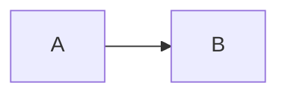

# `pdfmarq.md`

Markdown-to-PDF renderer with YAML frontmatter. Requires `pip install pdfmarq[md]`.

## `md_to_pdf`

```py
from pdfmarq.md import md_to_pdf
md_to_pdf(open("doc.md").read(), "doc.pdf", font_dir="./fonts")
# Landscape, and relative images resolved against a directory
from pdfmarq.constants import A4
md_to_pdf(md_text, "out.pdf", page=A4.landscape(), base_dir="./assets")
```

## Banner (YAML frontmatter)

YAML block at the top becomes a styled banner on page 1 plus a compact banner on continuation pages.

```yaml
---
id: TXR-1991-007
title: Roundhouse kick deployment protocol
version: 1.3.2
author: Walker, Texas Ranger
status: approved
entity: Texas Ranger Division
address: 1 Lone Star Boulevard, Dallas TX 75201
created: 1993-04-21
updated: 2026-03-15
logo: ./ranger-badge.svg
---

# Document body starts here
```

| Field       | Effect                                                                               |
| ----------- | ------------------------------------------------------------------------------------ |
| `id`        | Document code in code-style box (e.g. `MD-001`)                                      |
| `title`     | Main title, centered, large                                                          |
| `version`   | Version in code-style box (no `v` prefix added)                                      |
| `author`    | Author name, shown as `{banner_label_author}: ...`                                   |
| `status`    | Badge: `draft` / `review` / `approved` / `deprecated` / `archived`                   |
| `entity`    | Organization (left of banner, bold)                                                  |
| `address`   | Address (right of banner, muted)                                                     |
| `created`   | ISO date, formatted via `style.date_format`                                          |
| `updated`   | Same                                                                                 |
| `logo`      | Path to `.svg`/`.png`/`.jpg`, aspect-aware _(tall logos take less horizontal space)_ |
| `subject`   | Written to PDF metadata `/Subject`, not rendered                                     |
| `keywords`  | Written to PDF metadata `/Keywords`, string or YAML list                             |

PDF metadata _(`/Title`, `/Author`, `/Subject`, `/Keywords`)_ is auto-filled from matching YAML keys. Pass `metadata={...}` to `md_to_pdf()` to override per-key.

If the first body block is `# X` and `X` matches `title` exactly, the h1 is dropped to avoid showing the title twice. Only applies when the banner actually printed that title, so `banner=False` never costs you the heading. Disable with `skip_dup_title=False`.

## Presentation

Frontmatter carries content only. Everything visual comes from the caller, and `style=` is used **verbatim** - there is no layering and no diff-against-defaults heuristic, so you can set any value, including one equal to a `MarkdownStyle()` default.

```python
from pdfmarq.md import md_to_pdf, lang_style
from pdfmarq.constants import A4, page_size

style = lang_style("pl",  # banner/footer labels
  font_body="IBMPlexSans", font_head="Sora", font_mono="IBMPlexMono",
  body_size=11, line_height=1.4, image_max_h=120,
  banner=True, banner_compact=True, sign="approval",
  mermaid_theme="default", syntax_theme="default",
)
md_to_pdf(md, "out.pdf", style=style,
  page=A4, margin=25, gutter=0, base_dir=".", font_dir="./fonts")
```

`sign` takes `True` for one line, a `sign_labels` scenario _(`signature`, `approval`,
`contract`, localized by the language preset)_, or a list of custom labels drawn side
by side, sharing the content width.


`page` is a `PageSize` in mm: `A4`, `A4.landscape()`, `page_size("a3")` for a preset name (`A4`/`A3`/`A5`/`LETTER`/`LEGAL`, raises on anything else), or `PageSize(200, 250)` for a custom sheet.

Everything after `output_path` is keyword-only, so the argument order cannot silently diverge from `docmarq.md.md_to_docx`.

Mermaid diagrams use `font_body` for label text when a matching TTF lives in `font_dir`.

## Math

Two engines draw `$x^2$` and `$$...$$`, both to vector paths:

| `math_engine` | Renderer | Covers | Needs |
| ------------- | -------- | ------ | ----- |
| `auto` _(default)_ | MathJax, else mathtext | whichever is installed | - |
| `mathjax` | MathJax 4 | LaTeX math: `\underbrace` with its label, `\begin{cases}`, `\substack`, stretchable delimiters | Node + two npm packages |
| `mathtext` | matplotlib mathtext | a subset - no brace accents, no cases | `matplotlib` only |

```bash
npm install -g mathjax @mathjax/mathjax-newcm-font
```

`math_font` picks the typeface, from the font packages MathJax ships. Each was
measured against 230 TeX symbols a technical document reaches for - Greek,
operators, relations, arrows, set and logic notation, blackboard, script and
fraktur alphabets, stretchable delimiters, accents, `cases`, `substack`,
matrices, and Polish and German diacritics inside `\text{}`:

| `math_font` | Face | Coverage |
| ----------- | ---- | -------- |
| `newcm` _(default)_ | New Computer Modern | complete, the modern LaTeX look |
| `stix2` | STIX Two | complete, Times-like |
| `modern` | MathJax Modern | complete, Computer Modern lineage |
| `termes` | TeX Gyre Termes | Times-like, no `\square` |
| `pagella` | TeX Gyre Pagella | Palatino-like, no `\square` |
| `dejavu` | DejaVu Math | sans, no `\square` |

Two of MathJax's packages are left out. `tex` has no stretchable brace, so
`\underbrace` comes out broken. Fira Math misses twenty-one symbols, among them
`\setminus` `\bigcup` `\bigcap` `\top` `\bot` `\vdots` - a sans document is
better served by `dejavu`.

A formula holding a character its font lacks is rendered again in `newcm`, which
covers the whole range, and warns once. One formula in a second typeface reads
as a choice; the alternative is an empty box mid-line, because the substitute
MathJax reaches for is a system face reportlab does not have either.

Each font is a separate npm package - `newcm` needs
`@mathjax/mathjax-newcm-font`, `stix2` needs `@mathjax/mathjax-stix2-font`, and so
on. Asking for one that is not installed warns and falls back to `newcm`.

`math_fontset` belongs to mathtext and MathJax ignores it. MathJax output is
scaled so the formula x-height matches body text, and rendered SVG is cached in
`~/.cache/marq/mathjax/`.

`PDFMARQ_NODE_MODULES` names the global `node_modules` directory when asking
`npm root -g` for it is too slow - a deployment usually knows the path.

On the mathtext path, spellings it rejects are rewritten to ones it accepts
(`\le` to `\leq`, `\underbrace` to `\underline`), and `math_fontset` takes a
matplotlib preset _(`stix`, `stixsans`, `cm`, `dejavusans`, `dejavuserif`)_ or a
font family from `font_dir`, so formulas can carry the document typeface. A
family that cannot be loaded warns and falls back to `stixsans`.

A block formula wider than the column is scaled to fit and says so; splitting it
across two `$$` blocks reads better than shrinking.

## Internal links

Markdown anchor links work out of the box:

```md
See the [Notify characteristic](#bluetooth-low-energy) section.

## Bluetooth Low Energy
...
```

Each heading auto-registers a GitHub-style slug _(lowercase, spaces → hyphens, unicode preserved)_. Links to non-existent slugs render as plain text rather than crashing the build. Footnote refs `[^1]` jump to their definitions the same way.

## Local links

Paths without a schema _(`[x](file.md)`, `[x](folder/doc)`, `[x](/absolute/path)`)_ get the link style _(blue + underline)_ but no clickable action by default - a PDF can't follow a filesystem link. Set `link_root` to make them real URLs:

```py
MarkdownStyle(
  link_root="https://docs.company.com",  # root to prepend
  link_base="projects/foo",              # subfolder this doc sits in
)
```

Resolution:
- `[x](file.md)` → `https://docs.company.com/projects/foo/file.md`
- `[x](/abs/path)` → `https://docs.company.com/abs/path` _(absolute ignores base)_

## Style

Beyond the fields shown above:

```py
MarkdownStyle(
  page_number_label="Strona",  # "Strona 1/5" footer; None to disable
  page_number_total=True,      # False → "Strona 1" without total
  date_format="%d.%m.%Y",      # strftime pattern
  h1_page_break=False,         # True for chaptered documents
  skip_dup_title=True,         # drop `# X` if it matches frontmatter title
)
```

### Banner labels (i18n)

Labels in the banner, footer, and callouts are style fields. Defaults are English. Use `lang_style("pl"|"de"|...)` to apply a built-in preset, or override fields manually.

```py
from pdfmarq.md import lang_style, md_to_pdf
style = lang_style("pl", font_body="IBMPlexSans")
md_to_pdf(md_text, "out.pdf", style=style)
```

Built-in presets ship in `pdfmarq/md/presets.py` and currently cover `en` _(defaults)_, `pl`, `de`, `fr`, `es`, `it`, `cs`, `sk`. Each preset configures `page_number_label`, `date_format`, banner labels _(author / created / updated)_, signing scenarios _(`sign_labels`)_, and callout labels _(note / tip / important / warning / caution)_. Extend by adding entries to `LANG_PRESETS`.

For ad-hoc overrides without a preset, set fields directly:

```py
MarkdownStyle(
  page_number_label="Page",
  banner_label_author="Author",
  callout_label_warning="Heads up",
)
```

### Logo sizing

```py
MarkdownStyle(
  banner_logo_max_h=50,       # mm - big logo on page 1 (default 50)
  banner_logo_max_w=60,       # mm - caps wide logos (default 60)
  banner_compact_logo_max_h=12,  # mm - compact banner logo (default 12)
  banner_compact_logo_max_w=24,  # mm - caps wide logos (default 24)
)
```

Width cap kicks in for wide logos _(wordmarks, horizontal lockups)_. Height is reduced proportionally so aspect ratio is preserved.

### Heading sizes

```py
MarkdownStyle(h1_size=18, h2_size=14, h3_size=12, h4_size=11, h5_size=10, h6_size=10)
```

### Table zebra

```py
MarkdownStyle(table_zebra=True, table_zebra_bg=(0.985, 0.99, 0.995))
```

### Status badge palette

```py
MarkdownStyle(banner_status_colors={
  "draft":      ((0.93, 0.93, 0.95), (0.40, 0.44, 0.50)),
  "review":     ((1.00, 0.95, 0.78), (0.62, 0.40, 0.05)),
  "approved":   ((0.86, 0.96, 0.87), (0.10, 0.45, 0.18)),
  "deprecated": ((0.97, 0.85, 0.84), (0.65, 0.15, 0.10)),
  "archived":   ((0.86, 0.89, 0.93), (0.30, 0.36, 0.45)),
})
```

Custom keys are allowed: `status: zatwierdzony` works if `"zatwierdzony"` is in the palette.

## Features

````md
# Headings h1 through h6

**bold** *italic* ***bold italic*** ~~strike~~ `inline code`

- Unordered lists
  - Nested
1. Ordered lists

| GFM | tables |
| --- | -----: |
| A   |  right |

```py
# Fenced code with syntax highlighting (Pygments)
def hello(): pass
```

Math inline: $E = mc^2$  Block: $$\int_0^1 x\,dx$$



> Blockquote with left border

> [!NOTE]
> GitHub-style callouts: NOTE / TIP / IMPORTANT / WARNING / CAUTION

Footnotes[^1] and emoji :rocket: :sparkles:
[^1]: Definition at end of doc.
````

Paragraphs and tables pre-measure their height and break to a new page when they don't fit - no orphaned first lines across page breaks.

## HTML support

A small whitelist of raw HTML tags is recognized inside markdown. Everything else _(`<table>`, `<div>`, `<span>`, `<style>`, attributes)_ is dropped silently.

| Tag                  | Effect                                            |
| -------------------- | ------------------------------------------------- |
| `<b>`, `<strong>`    | Bold                                              |
| `<i>`, `<em>`        | Italic                                            |
| `<code>`             | Inline code _(mono family, code colors)_          |
| `<br>`               | Hard line break                                   |
| `<hr>`               | Horizontal rule _(block-level)_                   |

Tag set lives in `pdfmarq/md/md_html.py` if you need to extend it.

### Headerless tables

Markdown tables require a header row per spec, but a single-row "card" layout is a common pattern. A table with header but no body is rendered as headerless, useful for label/value blocks and contact cards:

```md
|  | Pocket Diagnostics Poland sp. z o.o<br>80-890 Gdańsk<br>Jana Heweliusza 11/811 |
| --- | --- |
```

### Setext-heading-with-image recovery

```md

---
```

CommonMark parses this as a setext h2 with the image as heading text. This is a common footgun that would render the image at heading-inline size _(thumbnail)_. `pdfmarq` detects the image-only setext case and renders it as a block image followed by an `<hr>`, matching the user's actual intent.

## Mixing with core API

```py
from pdfmarq import PDF
from pdfmarq.md import MarkdownRenderer, MarkdownStyle
pdf = PDF("out.pdf", font_dir="./fonts")
# Hand-crafted cover page
pdf.font("Helvetica", 36, "Bold").cursor(0, 80).text("Title", 170, align="C")
pdf.new_page()
# Markdown body (no banner - we already have a custom cover)
renderer = MarkdownRenderer(pdf, MarkdownStyle(banner=False))
renderer.render(open("body.md").read())
# Custom signature
pdf.enter(20).cursor(110, pdf.y).line(70, 0, 0.5, dash=(2, 2))
pdf.save()
```

## Optional deps for features

Installed by `pip install pdfmarq[md]`:
- `Pygments` - syntax highlighting in code blocks
- `matplotlib` - math formulas (`$x^2$`, `$$...$$`), the fallback engine
- `emoji`, `mdit-py-emoji` - `:shortcode:` emoji

System tools via npm, **not on PyPI**:
- `mermaid-cli` for ` ```mermaid ` blocks: `npm install -g @mermaid-js/mermaid-cli`.
  Without it the diagram source goes to the `mermaid.ink` HTTP service, which
  warns once per process; `mermaid_remote=False` keeps it offline and renders a
  code block instead.
- `mathjax` + its font for math: `npm install -g mathjax @mathjax/mathjax-newcm-font`.
  See [Math](#math) - without it formulas fall back to matplotlib.

A missing dependency degrades the feature, never the document: code renders
without highlighting, a mermaid block renders as a fenced code block, and a
formula matplotlib cannot parse comes out as its own source with a warning.
